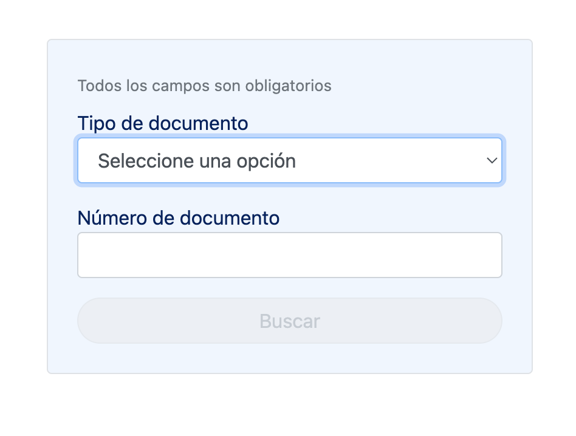
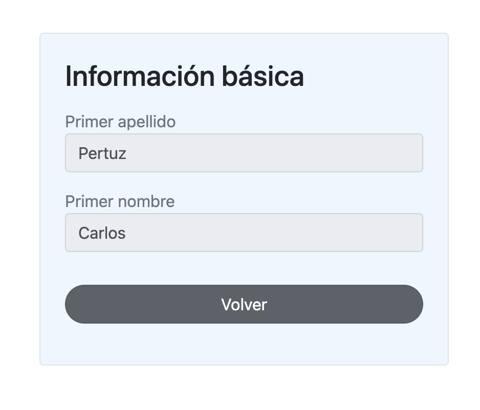

<div align="center">
 

### View Information page
This project is created for a technical test and was generated with [Angular CLI](https://github.com/angular/angular-cli) version 17.3.0.
</div>

<div align="center">
    <a href="#" target="_blank">
        Preview
    </a>
    <span>&nbsp;✦&nbsp;</span>
    <a href="#-getting-started">
        Getting Started
    </a>
    <span>&nbsp;✦&nbsp;</span>
    <a href="#-commands">
        Commands
    </a>
    <span>&nbsp;✦&nbsp;</span>
    <a href="#-license">
        License
    </a>
    <span>&nbsp;✦&nbsp;</span>
    <a href="https://twitter.com/MiguelA66750525" target="_blank">
        Twitter
    </a>
</div>

<p></p>

<div align="center">

 


</div>

> [!WARNING]
> This page is an technical proof. I reserve any liability that may arise from improper handling of this public resource, warning about the possible consequences that could arise as a result of improper handling.

## 🛠️ Stack

- [**Angular**](https://angular.io/) - An open source framewok developed in TypeScript that is used to build single page applications (SPA), dynamic web applications and mobiles.
- [**Typescript**](https://www.typescriptlang.org/) - JavaScript with syntax for types.
- [**Bootstrap**](https://getbootstrap.com/docs/4.6/getting-started/introduction/) - Is the most popular CSS Framework for developing responsive and mobile-first websites.
- [**Google fonts**](https://fonts.google.com/) - Self-host fonts in neatly bundled in CDN.

## 🚀 Getting Started

1. [Fork](https://github.com/McastilloA/viewInformation/fork) or clone this repository.

```bash
# Clone repository in local:
git clone https://github.com/McastilloA/viewInformation.git

# Go to folder with MacOS, WSL & Linux:
cd viewInformation

# Go to folder with Windows:
dir viewInformation
```

2. Install the dependencies, which is installed by default when you download [NodeJS](https://nodejs.org/en) or [NVM](https://github.com/nvm-sh/nvm)

- You can use **npm**:


<!-- ```bash
# Install bun for MacOS, WSL & Linux:
curl -fsSL https://bun.sh/install | bash

# Install bun for Windows:
powershell -c "iwr bun.sh/install.ps1|iex"

# Install with bun:
bun install
``` -->


```bash
# 1. Install npm globally if you don't have it:
npm install -g npm

# 2. Install angular/cli globally if you don't have it:
npm install -g @angular/cli
```

- or you can use [pnpm](https://pnpm.io):

```bash
# 1. Install pnpm globally if you don't have it:
npm install -g pnpm

# (Optional) You can pin the version of pnpm used on 
# your project using the following command:
corepack use pnpm

# 2. Install angular/cli in folder if you don't have it:
pnpm install @angular/cli

# 3. Install dependencies:
pnpm install
```

3. Run the development server:

```bash
# Run with npm:
npm start

# Run with pnpm:
pnpm start
```

4. Open [**http://localhost:4200**](http://localhost:4200/) with your browser to see the result 🚀

<!-- ### 🤝 Contributing
<a href="https://github.com/McastilloA/sportsBetting/graphs/contributors">
  
</a> -->


## 🤩 Application functionality 

Sections of list dates and list de matches the module **consult** 



Components the module **summary** 





## 🫡 Commands

|     | Command          | Action                                        |
| :-- | :--------------- | :-------------------------------------------- |
| ⚙️ | `start` | Starts local dev server at `localhost:4200`.  |
| ⚙️ | `build` | The build artifacts will be stored in the `dist/` directory. |
| ⚙️ | `test` | execute the unit tests via [Karma](https://karma-runner.github.io). |
| ⚙️ | `e2e` | execute the end-to-end tests via a platform of your choice. To use this command, you need to first add a package that implements end-to-end testing capabilities. |
| ⚙️ | `preview` | Preview your build locally, before deploying. |


## 💻 Code scaffolding

Run `ng generate component component-name` to generate a new component. You can also use `ng generate directive|pipe|service|class|guard|interface|enum|module|etc`.


## ☎️ Further help

To get more help on the Angular CLI use `ng help` or go check out the [Angular CLI Overview and Command Reference](https://angular.io/cli) page.


## 🔑 License

[MIT](#) - Created by [**@mclasteVerse**](https://github.com/McastilloA).
